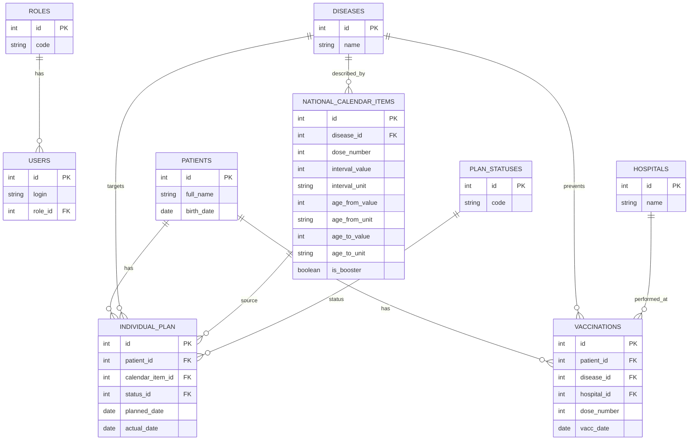

```mermaid
erDiagram
    ROLES ||--o{ USERS : has
    USERS {
        int id PK
        string login
        int role_id FK
    }
    ROLES {
        int id PK
        string code
    }
    PATIENTS ||--o{ VACCINATIONS : has
    PATIENTS ||--o{ INDIVIDUAL_PLAN : has
    DISEASES ||--o{ NATIONAL_CALENDAR_ITEMS : described_by
    DISEASES ||--o{ VACCINATIONS : prevents
    DISEASES ||--o{ INDIVIDUAL_PLAN : targets
    HOSPITALS ||--o{ VACCINATIONS : performed_at
    NATIONAL_CALENDAR_ITEMS ||--o{ INDIVIDUAL_PLAN : source
    PLAN_STATUSES ||--o{ INDIVIDUAL_PLAN : status
    PATIENTS {
        int id PK
        string full_name
        date birth_date
    }
    DISEASES {
        int id PK
        string name
    }
    NATIONAL_CALENDAR_ITEMS {
        int id PK
        int disease_id FK
        int dose_number
        int interval_value
        string interval_unit
        int age_from_value
        string age_from_unit
        int age_to_value
        string age_to_unit
        boolean is_booster
    }
    VACCINATIONS {
        int id PK
        int patient_id FK
        int disease_id FK
        int hospital_id FK
        int dose_number
        date vacc_date
    }
    INDIVIDUAL_PLAN {
        int id PK
        int patient_id FK
        int calendar_item_id FK
        int status_id FK
        date planned_date
        date actual_date
    }
    PLAN_STATUSES {
        int id PK
        string code
    }
    HOSPITALS {
        int id PK
        string name
    }

```